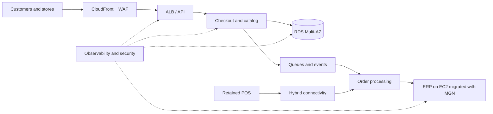

# AWS Migration and Modernization for Omnichannel Retail

Professional project documenting the assessment, mobilization, and migration of a retail application portfolio to AWS. The organization is identified as **Confidential Client**, and all case data is aggregated or anonymized.

| Field | Value |
|---|---|
| Program baseline | May 2026 |
| Planned start | May 4, 2026 |
| Stabilization completion | June 26, 2026 |
| Method | 7 Rs, AWS Well-Architected, and wave-based migration |

## Executive summary

The organization operates e-commerce, physical stores, and back-office processes across VMware, physical servers, and commercial software. Seasonal growth exposes capacity constraints, manual recovery procedures, slow deployments, and costs that are difficult to allocate.

The program classifies seven workloads using the **7 Rs of migration**, establishes a landing zone, performs a controlled rehost with AWS Transform MGN, and modernizes the components that provide competitive advantage. The target architecture is assessed against the six pillars of the AWS Well-Architected Framework.

### Business case targets

| Indicator | Baseline | Target | Validation method |
|---|---:|---:|---|
| Digital channel availability | 99.50% | 99.95% | Monthly successful-request SLI |
| Recovery time objective (RTO) | 8 h | 60 min | Recovery exercise |
| Recovery point objective (RPO) | 24 h | 15 min | Restore and reconciliation test |
| Provisioning time | 10 days | < 2 h | Infrastructure pipeline |
| Deployment frequency | Monthly | Weekly | CI/CD history |
| Unit cost per order | Index 100 | ≤ 82 | Cost allocation / completed orders |

These values are business case targets, not claimed production results. Reproducible laboratory measurements are documented in [`docs/09-kpis-y-evidencia.md`](docs/09-kpis-y-evidencia.md).

## 7 Rs scope

| R | Workload | Decision | Expected outcome |
|---|---|---|---|
| Retire | Legacy batch catalog | Decommission after data reconciliation | Eliminate obsolete support and risk |
| Retain | Store POS | Keep during the first phase | Avoid store disruption |
| Rehost | Auxiliary ERP on VMware | Migrate to EC2 with MGN | Exit hardware approaching renewal |
| Relocate | VMware integration cluster | Move without initial redesign | Accelerate data-center exit |
| Repurchase | On-premises CRM | Replace with SaaS | Standardize sales and support |
| Replatform | Inventory database | Migrate to Amazon RDS | Reduce operations and improve recovery |
| Refactor | Checkout monolith | Decoupled services and events | Scale orders and accelerate change |

The complete matrix and decision criteria are in [`docs/03-evaluacion-7r.md`](docs/03-evaluacion-7r.md).

## Architecture and method



The program follows four movements: discover and assess, prepare the platform, migrate in waves, and optimize. MGN is used only where the decision is rehost; it is not attributed to the other strategies.

## Migration waves

The plan baseline was established in **May 2026**. Waves separate platform preparation, exit movements, and modernization to maintain explicit go/no-go and rollback criteria.

| Wave | Planned window | Scope | Primary strategy | Exit gate |
|---|---|---|---|---|
| 0 | May 4–8, 2026 | Landing zone, network, identity, and logs | Foundation | Controls and connectivity approved |
| 1 | May 11–15, 2026 | Catalog retirement and pilot workload | Retire | Reconciliation complete and support stabilized |
| 2 | May 18–22, 2026 | Auxiliary ERP to EC2 through MGN | Rehost | UAT, performance, and rollback approved |
| 3 | May 25–29, 2026 | Inventory database to Amazon RDS | Replatform | Integrity, RPO, and performance approved |
| 4 | June 1–12, 2026 | SaaS CRM and VMware integrations | Repurchase / Relocate | Contracts, data, and operations approved |
| 5 | June 15–22, 2026 | Progressive checkout modernization | Refactor | SLO and progressive deployment approved |
| Stabilization | June 23–26, 2026 | Hypercare, cost, security, and closure | Optimize | KPIs and executive acceptance |

The detailed schedule, common gates, and rollback criteria are in [`docs/06-plan-de-olas.md`](docs/06-plan-de-olas.md).

## Cutover calendar

Waves define working periods; cutovers are the specific windows in which service, data, or traffic changes.

| Cutover | Wave | Date and window | Workload | Movement |
|---|---|---|---|---|
| CO-01 | 1 | May 15, 21:00–23:00 | Legacy catalog | Retire |
| CO-02 | 2 | May 22, 22:00–May 23, 02:00 | Auxiliary ERP | Rehost with MGN |
| CO-03 | 3 | May 29, 22:00–May 30, 03:00 | Inventory | Replatform to RDS |
| CO-04 | 4 | June 12, 21:00–June 13, 02:00 | CRM and integrations | Repurchase / Relocate |
| CO-05 | 5 | June 22, 22:00–June 23, 01:00 | Checkout | Progressive refactor |

All windows use the `America/Mexico_City` time zone. Go/no-go criteria, rollback thresholds, roles, and checkpoints are defined in [`docs/10-plan-de-cutover.md`](docs/10-plan-de-cutover.md).

## Repository contents

- [`docs/00-resumen-ejecutivo.md`](docs/00-resumen-ejecutivo.md): executive narrative.
- [`docs/01-caso-de-negocio.md`](docs/01-caso-de-negocio.md): value, cost, benefits, and governance.
- [`docs/02-estado-actual.md`](docs/02-estado-actual.md): scope, dependencies, and constraints.
- [`docs/03-evaluacion-7r.md`](docs/03-evaluacion-7r.md): portfolio rationalization.
- [`docs/04-arquitectura-objetivo.md`](docs/04-arquitectura-objetivo.md): solution design.
- [`docs/05-well-architected.md`](docs/05-well-architected.md): six-pillar review.
- [`docs/06-plan-de-olas.md`](docs/06-plan-de-olas.md): schedule, gates, and rollback.
- [`docs/07-runbook-mgn.md`](docs/07-runbook-mgn.md): rehost testing and cutover.
- [`docs/08-riesgos-y-raci.md`](docs/08-riesgos-y-raci.md): risks, owners, and controls.
- [`docs/09-kpis-y-evidencia.md`](docs/09-kpis-y-evidencia.md): outcome traceability.
- [`docs/10-plan-de-cutover.md`](docs/10-plan-de-cutover.md): windows, responsibilities, and rollback.
- [`docs/11-operacion-aws-transform-mgn.md`](docs/11-operacion-aws-transform-mgn.md): source servers, applications, waves, global view, history, connectors, and import/export.
- [`data/application-portfolio.csv`](data/application-portfolio.csv): decision inventory.
- [`data/mgn-import-wave-02.csv`](data/mgn-import-wave-02.csv): MGN CSV import example.
- [`infra/terraform`](infra/terraform): deployable private landing zone with TGW routing, network controls, Flow Logs, alarms, and dashboard.

## Terraform network foundation

| Layer | CIDR / component | Purpose |
|---|---|---|
| VPC | `10.40.0.0/16` | Existing migration address space retained |
| Receptor subnet | `10.40.0.0/24` | Static migration receptor layer |
| Transit subnet | `10.40.1.0/24` | Transit Gateway VPC attachment |
| Private subnet A | `10.40.10.0/24` | Migrated workloads in the first AZ |
| Private subnet B | `10.40.20.0/24` | Migrated workloads in the second AZ |

The foundation deliberately creates **no NAT Gateway and no Internet Gateway**. Workload egress follows `private subnet → TGW → VPN/Direct Connect attachment → on-premises proxy or firewall`. The TGW default route is created only when `on_premises_tgw_attachment_id` references a real external attachment. See [`infra/terraform/README.md`](infra/terraform/README.md) for the resource map, safeguards, and deployment sequence.

## Infrastructure validation

```bash
cd infra/terraform
terraform fmt -check -recursive
terraform init -backend=false
terraform validate
```

The code is intended for review and laboratory use. Before creating resources, configure a sandbox account, budget limits, an approved region, and security controls.

### Terraform deployment

```bash
cd infra/terraform
terraform init
terraform plan -out=c2kmig.tfplan
terraform apply c2kmig.tfplan
```

The configuration avoids NAT Gateway and compute resources to control initial cost. Review the complete plan before running `apply`.

## Information governance

This repository contains no company names, credentials, personal data, exported configurations, or third-party infrastructure identifiers. Decisions are documented as a professional portfolio project and must be evaluated against the real context before reuse.
