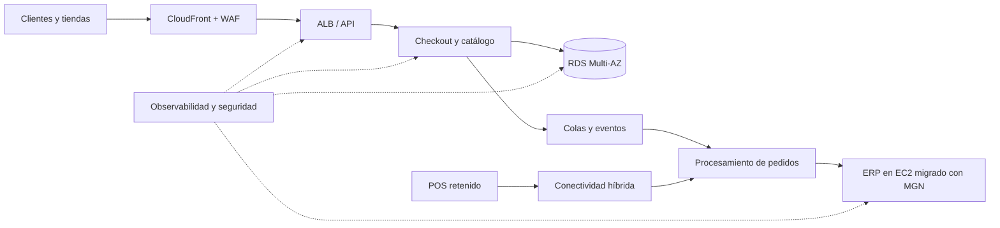

# Migración y modernización AWS para retail omnicanal

Proyecto de trabajo que documenta la evaluación, movilización y migración de un portafolio retail hacia AWS. La organización se identifica como **Cliente Confidencial** y los datos del caso se presentan de forma agregada o anonimizada.

| Campo | Valor |
|---|---|
| Línea base del programa | Mayo de 2026 |
| Inicio planificado | 4 de mayo de 2026 |
| Fin de estabilización | 26 de junio de 2026 |
| Método | 7 R, AWS Well-Architected y migración por olas |

## Resumen ejecutivo

La organización opera comercio electrónico, tiendas físicas y procesos de back office sobre una combinación de VMware, servidores físicos y software comercial. El crecimiento estacional expone limitaciones de capacidad, recuperaciones manuales, despliegues lentos y costos difíciles de atribuir.

El programa clasifica siete cargas mediante las **7 R de migración**, establece una landing zone, ejecuta un rehost controlado con AWS Transform MGN y moderniza los componentes que aportan una ventaja competitiva. La arquitectura objetivo se evalúa con los seis pilares del AWS Well-Architected Framework.

### Resultados objetivo del business case

| Indicador | Línea base | Objetivo | Método de validación |
|---|---:|---:|---|
| Disponibilidad del canal digital | 99.50% | 99.95% | SLI mensual de solicitudes exitosas |
| Tiempo de recuperación (RTO) | 8 h | 60 min | Ejercicio de recuperación |
| Punto de recuperación (RPO) | 24 h | 15 min | Prueba de restauración y reconciliación |
| Tiempo de aprovisionamiento | 10 días | < 2 h | Pipeline de infraestructura |
| Frecuencia de despliegue | Mensual | Semanal | Historial de CI/CD |
| Costo unitario por pedido | Índice 100 | ≤ 82 | Cost allocation / pedidos completados |

Los valores son objetivos del caso de negocio; no se presentan como resultados de producción. Las mediciones reproducibles del laboratorio se registran en [`docs/09-kpis-y-evidencia.md`](docs/09-kpis-y-evidencia.md).

## Alcance de las 7 R

| R | Carga | Decisión | Resultado esperado |
|---|---|---|---|
| Retire | Catálogo batch heredado | Desactivar tras reconciliar datos | Eliminar soporte y riesgo obsoleto |
| Retain | POS de tiendas | Mantener durante la primera fase | Evitar interrupción en sucursales |
| Rehost | ERP auxiliar en VMware | Migrar a EC2 con MGN | Salir del hardware próximo a renovación |
| Relocate | Clúster VMware de integraciones | Trasladar sin rediseño inicial | Reducir plazo de salida del datacenter |
| Repurchase | CRM instalado localmente | Sustituir por SaaS | Estandarizar ventas y soporte |
| Replatform | Base de datos de inventario | Migrar a Amazon RDS | Reducir operación y mejorar recuperación |
| Refactor | Checkout monolítico | Servicios desacoplados y eventos | Escalar pedidos y acelerar cambios |

La matriz completa y los criterios de decisión están en [`docs/03-evaluacion-7r.md`](docs/03-evaluacion-7r.md).

## Arquitectura y método



El programa sigue cuatro movimientos: descubrir y evaluar, preparar la plataforma, migrar por olas y optimizar. MGN se utiliza exclusivamente donde la decisión es rehost; no se atribuye a las demás estrategias.

## Waves de migración

La línea base del plan fue establecida en **mayo de 2026**. Las olas separan la preparación, los movimientos de salida y la modernización para mantener criterios claros de go/no-go y reversa.

| Wave | Ventana planificada | Alcance | Estrategia principal | Gate de salida |
|---|---|---|---|---|
| 0 | 4–8 mayo 2026 | Landing zone, red, identidad y logs | Foundation | Controles y conectividad aprobados |
| 1 | 11–15 mayo 2026 | Retiro del catálogo y carga piloto | Retire | Reconciliación y soporte estabilizado |
| 2 | 18–22 mayo 2026 | ERP auxiliar hacia EC2 mediante MGN | Rehost | UAT, rendimiento y rollback aprobados |
| 3 | 25–29 mayo 2026 | Base de inventario hacia Amazon RDS | Replatform | Integridad, RPO y rendimiento aprobados |
| 4 | 1–12 junio 2026 | CRM SaaS e integraciones VMware | Repurchase / Relocate | Contratos, datos y operación aprobados |
| 5 | 15–22 junio 2026 | Modernización progresiva de checkout | Refactor | SLO y despliegue progresivo aprobados |
| Estabilización | 23–26 junio 2026 | Hypercare, costos, seguridad y cierre | Optimize | KPIs y aceptación ejecutiva |

El calendario detallado, los gates comunes y el criterio de rollback están en [`docs/06-plan-de-olas.md`](docs/06-plan-de-olas.md).

## Calendario de cutovers

Las waves indican periodos de trabajo; los cutovers son las ventanas específicas en las que cambia el servicio, los datos o el tráfico.

| Cutover | Wave | Fecha y ventana | Carga | Movimiento |
|---|---|---|---|---|
| CO-01 | 1 | 15 mayo, 21:00–23:00 | Catálogo heredado | Retire |
| CO-02 | 2 | 22 mayo, 22:00–23 mayo, 02:00 | ERP auxiliar | Rehost con MGN |
| CO-03 | 3 | 29 mayo, 22:00–30 mayo, 03:00 | Inventario | Replatform a RDS |
| CO-04 | 4 | 12 junio, 21:00–13 junio, 02:00 | CRM e integraciones | Repurchase / Relocate |
| CO-05 | 5 | 22 junio, 22:00–23 junio, 01:00 | Checkout | Refactor progresivo |

Todas las ventanas utilizan la zona horaria `America/Mexico_City`. Los criterios go/no-go, umbrales de rollback, roles y checkpoints se encuentran en [`docs/10-plan-de-cutover.md`](docs/10-plan-de-cutover.md).

## Contenido del repositorio

- [`docs/00-resumen-ejecutivo.md`](docs/00-resumen-ejecutivo.md): narrativa para dirección.
- [`docs/01-caso-de-negocio.md`](docs/01-caso-de-negocio.md): valor, costos, beneficios y gobierno.
- [`docs/02-estado-actual.md`](docs/02-estado-actual.md): alcance, dependencias y restricciones.
- [`docs/03-evaluacion-7r.md`](docs/03-evaluacion-7r.md): racionalización del portafolio.
- [`docs/04-arquitectura-objetivo.md`](docs/04-arquitectura-objetivo.md): diseño de la solución.
- [`docs/05-well-architected.md`](docs/05-well-architected.md): revisión de los seis pilares.
- [`docs/06-plan-de-olas.md`](docs/06-plan-de-olas.md): calendario, gates y rollback.
- [`docs/07-runbook-mgn.md`](docs/07-runbook-mgn.md): prueba y cutover del rehost.
- [`docs/08-riesgos-y-raci.md`](docs/08-riesgos-y-raci.md): riesgos, responsables y controles.
- [`docs/09-kpis-y-evidencia.md`](docs/09-kpis-y-evidencia.md): trazabilidad de resultados.
- [`docs/10-plan-de-cutover.md`](docs/10-plan-de-cutover.md): ventanas, responsables y reversa.
- [`docs/11-operacion-aws-transform-mgn.md`](docs/11-operacion-aws-transform-mgn.md): source servers, applications, waves, global view, history, connectors e import/export.
- [`data/application-portfolio.csv`](data/application-portfolio.csv): inventario de decisiones.
- [`data/mgn-import-wave-02.csv`](data/mgn-import-wave-02.csv): ejemplo de inventario CSV para MGN.
- [`infra/terraform`](infra/terraform): landing zone desplegable como código.

## Cómo validar la infraestructura

```bash
cd infra/terraform
terraform fmt -check -recursive
terraform init -backend=false
terraform validate
```

El código está diseñado para revisión y laboratorio. Antes de aplicar recursos debe configurarse una cuenta sandbox, límites de presupuesto, región permitida y controles de seguridad.

### Despliegue con Terraform

```bash
cd infra/terraform
terraform init
terraform plan -out=c2kmig.tfplan
terraform apply c2kmig.tfplan
```

La configuración evita NAT Gateway y recursos de cómputo para controlar el costo inicial. Revisa el plan completo antes de ejecutar `apply`.

## Gobierno de información

Este repositorio no contiene nombres de compañías, credenciales, datos personales, configuraciones exportadas ni identificadores de infraestructura de terceros. Las decisiones se documentan como un proyecto de trabajo de portafolio y deben evaluarse contra el contexto real antes de reutilizarse.
