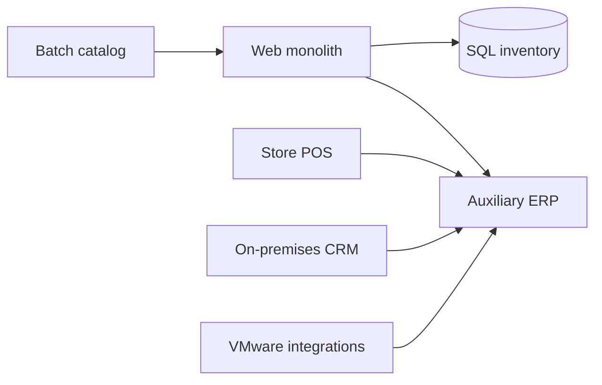

# Current State and Discovery

## Logical view

## Findings

- Dependencies are known through interviews rather than centralized telemetry.
- Web and inventory share maintenance windows.
- ERP integrates through files and scheduled jobs.
- POS depends on store connectivity and must operate through interruptions.
- Service accounts and certificates have no single inventory.
- Capacity reports do not separate normal demand from campaigns.

## Minimum discovery data

For every workload, collect owner, criticality, environment, operating system, database, CPU/memory, storage, growth, ports, dependencies, SLA, RTO, RPO, licenses, windows, data classification, and commercial calendar.

## Readiness criteria

A workload does not enter a wave if it lacks an owner, dependency map, acceptance criteria, verified backup, approved window, or practical rollback.
