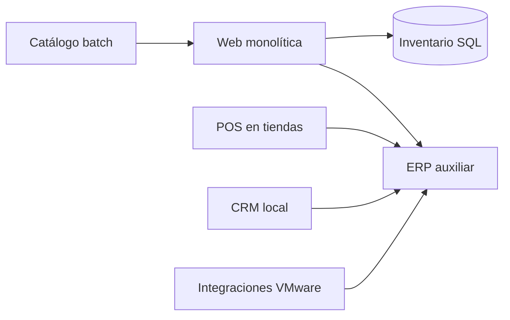

# Estado actual y descubrimiento

## Vista lógica

## Hallazgos

- Dependencias se conocen por entrevistas, no por telemetría centralizada.
- Web e inventario comparten ventanas de mantenimiento.
- ERP tiene integración por archivos y tareas programadas.
- POS depende de conectividad de sucursales y debe operar ante interrupciones.
- Las cuentas de servicio y certificados no tienen inventario único.
- Los reportes de capacidad no separan demanda normal de campañas.

## Datos mínimos de descubrimiento

Para cada carga se recopilan propietario, criticidad, ambiente, sistema operativo, base de datos, CPU/memoria, almacenamiento, crecimiento, puertos, dependencias, SLA, RTO, RPO, licencias, ventanas, clasificación de datos y calendario comercial.

## Criterios de readiness

Una carga no entra a una ola si carece de propietario, mapa de dependencias, criterio de aceptación, backup verificado, ventana aprobada o reversa practicable.

