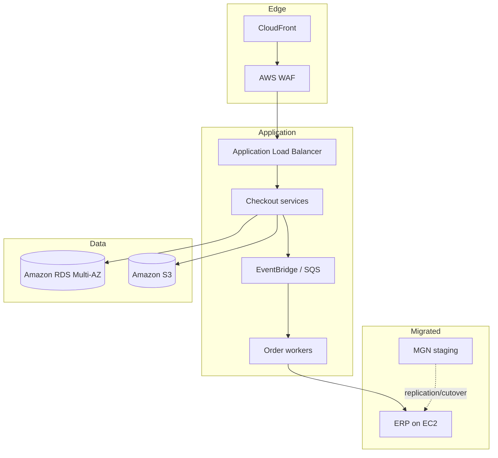

# Arquitectura objetivo

## Principios

- Separación de cuentas por ambiente y función.
- Acceso humano federado; sin usuarios permanentes para operación diaria.
- Cifrado, registros y etiquetado habilitados desde la plataforma.
- Alta disponibilidad proporcional a la criticidad.
- Preferencia por servicios administrados cuando reduce carga operativa.
- Interfaces asíncronas para absorber picos y fallas transitorias.

## Flujo objetivo

## Controles transversales

CloudTrail y logs centralizados, métricas y alarmas, detección de configuración, gestión de secretos, backups con pruebas de restauración, etiquetado obligatorio y presupuestos por cuenta. Los servicios exactos se confirman mediante requisitos, región y costo; el diagrama no reemplaza el diseño detallado.

