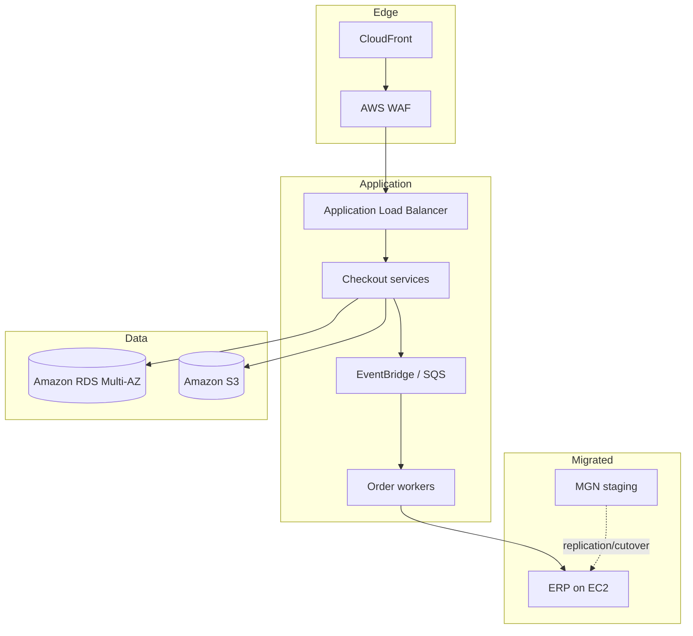

# Target Architecture

## Principles

- Separate accounts by environment and function.
- Federated human access with no permanent users for daily operations.
- Encryption, logging, and tagging enabled at the platform level.
- High availability proportional to criticality.
- Prefer managed services when they reduce operational burden.
- Use asynchronous interfaces to absorb peaks and transient failures.

## Target flow

## Cross-cutting controls

CloudTrail and centralized logs, metrics and alarms, configuration detection, secrets management, backups with restore testing, mandatory tagging, and account-level budgets. Exact services are confirmed from requirements, region, and cost; the diagram does not replace detailed design.
